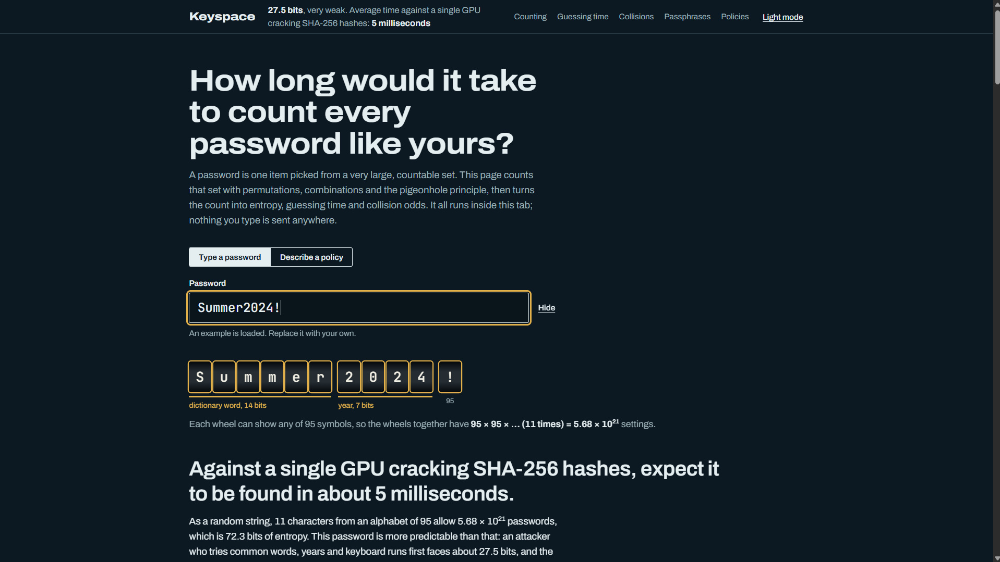

# Keyspace: Password Strength and Collision Analyzer

A web dashboard that treats a password as one item picked from a very large, countable set. It counts that set with **permutations, combinations, inclusion–exclusion and the pigeonhole principle**, then turns the count into **entropy, brute-force time and collision probability**.

**Live demo:** https://zephyr-debugs.github.io/Password-Cryptographic-Analyzer-/

   

Everything runs in the browser. There is no backend, no build step and no dependencies, and nothing you type is sent anywhere.

---

## What it does

Type a password, or describe a policy such as "12 characters, letters and digits", and the dashboard answers three questions:

1. **How many passwords could this be?** Exact big-integer counts under several counting models.
2. **How long would it take to guess?** Average and worst-case time against five attacker profiles, or a custom guess rate.
3. **When do collisions appear?** Pigeonhole guarantees and birthday-bound probabilities for hash functions, plus how many users it takes before two share a password.

### Features

| Section | What you get |
|---|---|
| Password wheels | Each character shown as an odometer wheel with its alphabet size. Detected patterns (words, years, sequences, keyboard runs, repeats) are bracketed with their bit cost |
| Verdict | Entropy if random, entropy as typed (pattern-aware), a rating, average guesses, and worst-case sweep time |
| Counting | R^L, P(R, L), C(R, L), C(R + L − 1, L), total over all lengths, "at least one of each class" by inclusion–exclusion, and rearrangements of your own characters |
| Guessing time | Log-scale chart of time against length for several alphabets, and a table by attacker |
| Collisions | Birthday curves for 16 to 256-bit hashes, the pigeonhole point, and a shared-password calculator |
| Collision lab | A toy hash with 16 to 1,024 buckets. Hash random passwords one at a time, or repeat 2,000 runs and compare with the birthday formula |
| Passphrases | k words from a list of D words, with the strength that word order adds |
| Policy comparison | PINs, short and long passwords and passphrases side by side |
| Summary | A copyable plain-text report containing lengths and counts, never the password |

---

## The mathematics

| Idea | Used for |
|---|---|
| Permutations with repetition, `R^L` | Keyspace for L characters over an alphabet of R symbols |
| Permutations `P(R, L) = R! / (R − L)!` | Passwords with no repeated character |
| Combinations `C(R, L)` | What the count would be if order did not matter |
| Inclusion–exclusion | Passwords that contain at least one character from every selected class |
| Pigeonhole principle | More inputs than 2^b hash outputs forces a collision |
| Birthday bound | Collision becomes likely after about 2^(b/2) inputs |

Key formulas:

```text
Keyspace                N = R^L
Entropy                 H = L · log2(R) bits
Average time            (N / 2) / guesses_per_second
Collision probability   P ≈ 1 − exp( −n(n−1) / 2^(b+1) )
Inputs for probability p   n ≈ sqrt( 2 · 2^b · ln(1 / (1 − p)) )
```

**Worked example.** Eight lowercase letters give 26^8 ≈ 2.1 × 10^11 passwords, about 37.6 bits. At 2 × 10^10 guesses per second the average time is roughly 5 seconds. Twelve random printable characters give 95^12 ≈ 5.4 × 10^23 passwords, about 78.8 bits, which is far out of brute-force reach.

---

## Cryptography notes

- **Entropy measures guessing work.** Each extra bit doubles the attacker's effort, and each extra character adds log2(R) bits, so length usually beats clever symbols.
- **Guess rate depends on the system.** An online login allows a handful of guesses a second. An attacker holding stolen hashes can try billions a second against fast hashes such as MD5 or SHA-256. Slow hashes such as bcrypt and Argon2 cut that rate by orders of magnitude.
- **Real passwords are not uniform.** People choose words, years and keyboard runs, so a pattern-aware attacker faces far fewer possibilities than R^L suggests.
- **Collisions are guaranteed, not just likely.** A b-bit hash has 2^b outputs, so 2^b + 1 inputs must collide. The birthday bound shows they appear far sooner, which is why a b-bit hash offers only about b/2 bits of collision resistance.

---

## Run it locally

No installation is needed.

**Option 1:** open `index.html` in any modern browser.

**Option 2:** serve the folder with Python:

```bash
python -m http.server 8000
```

Then open `http://localhost:8000`.

The page loads two fonts (Archivo and JetBrains Mono) from Google Fonts. Offline, it falls back to system fonts and works the same.

---

## Project structure

```text
.
├── index.html   Page structure and explanatory text
├── style.css    Styling, including light and dark themes
├── app.js       Counting engine, entropy model, charts, collision lab
└── README.md
```

## Built with

- HTML, CSS and vanilla JavaScript
- JavaScript `BigInt` for exact counts of very large numbers
- Hand-drawn SVG charts, with no chart library
- An FNV-1a style toy hash for the collision lab

---

## Limitations

- The pattern-aware estimate uses a small built-in word list, so real attackers with larger lists do better. It illustrates the idea and is not a substitute for a tool such as zxcvbn.
- Attacker guess rates are order-of-magnitude assumptions for comparison, not benchmarks.
- Characters outside printable ASCII are counted as a pool of 100, a rough guess.
- The project does not cover salting or key stretching, which are the usual defences against precomputed and brute-force attacks.
- Passwords that are reused, previously leaked, or built from personal details are weaker than any figure shown here.
